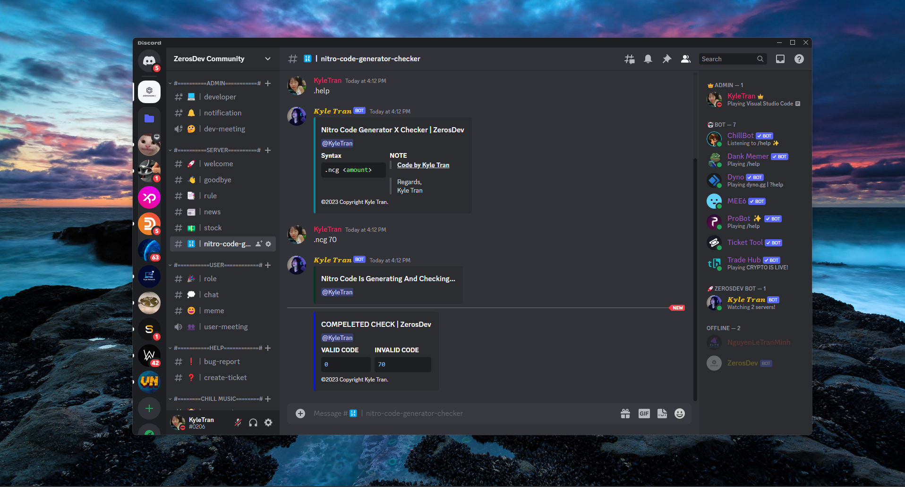
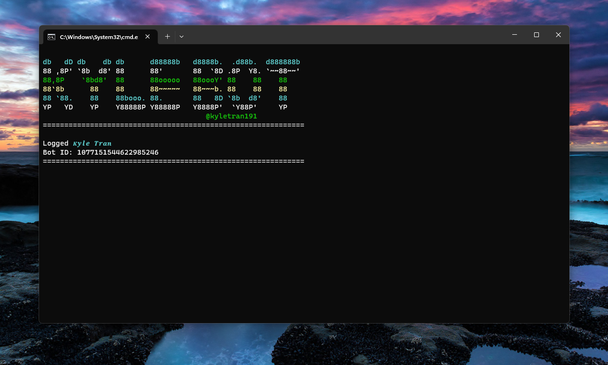

<!-- Kylebot -->
<p align="center"></p>
<p align="center">
  
  
  
  
  
</p>

<p align="center">
  
  
  </a>
</p>

### Features

- Generator and check discord nitro code 
### Installation
- Install
  ```
  download python: https://www.python.org/downloads/
  pip install -r requirements.txt
  ```

- Clone this repository -
  ```
  git clone https://github.com/kyletran191/nitro-bot.git
  ```
- Now go to run `bot.py` -
  ```
  $ cd nitro-bot
  $ python bot.py
  ```
<h1>About bot</h1>
<p><li>Author: Kyle Tran</li></p>
<p><li>Version: 1.2</li></p>
<p><li>Language: Python</li></p>
<p><li>License: GNU General Public License v3.0</li></p>
<h1>Preview</h1>
<p align="center"></p>
<p align="center"></p>
<h1>Contact</h1>
<p><li>Email: contact@tranbaokha.com</li></p>
<p><li>Discord: KyleTran#0206</li></p>
<p><li>Telegram: @kyletran1901</li></p>
<h1>Thanks for using</h1>
<p><li>Please press star and fork if you find it interesting</li></p>

